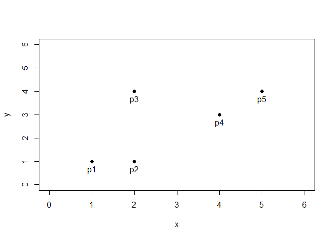
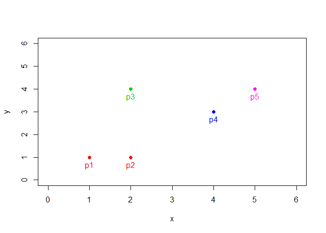
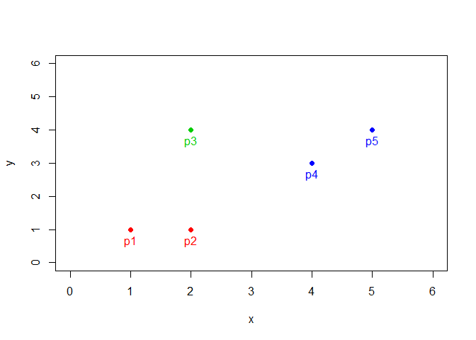
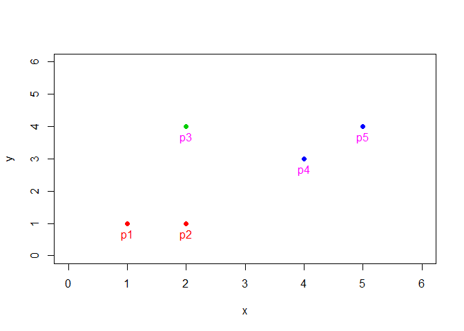
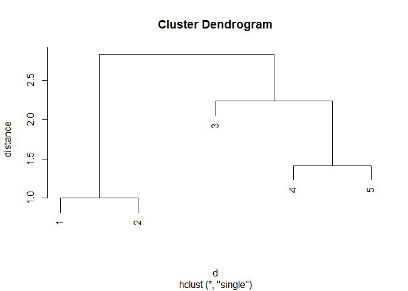

# 응집형 계층적 클러스터링 (Agglomerative Hierachical Clustering)

## 그래프 기반 방법 (Graph based method)

### 단일 연결법 (Single linkage method)


```r
x <- c(1,2,2,4,5)
y <- c(1,1,4,3,4)
df <- data.frame(cbind(x,y))
df
```

```
  x y
1 1 1
2 2 1
3 2 4
4 4 3
5 5 4
```

\ 

산점도scatter plot of df


```r
plot(df, pch=19, xlim=c(0,6), ylim=c(0,6))
text(df[,1], df[,2], labels=paste0("p",1:5), pos=1)
```

<!-- -->

\ 

거리행렬(proximity matrix) : squares of euclidian distance matrix for 5 points


```r
d <- dist(df, method="euclidian")
d
```

```
         1        2        3        4
2 1.000000                           
3 3.162278 3.000000                  
4 3.605551 2.828427 2.236068         
5 5.000000 4.242641 3.000000 1.414214
```

```r
temp <- as.matrix(d)
temp
```

```
         1        2        3        4        5
1 0.000000 1.000000 3.162278 3.605551 5.000000
2 1.000000 0.000000 3.000000 2.828427 4.242641
3 3.162278 3.000000 0.000000 2.236068 3.000000
4 3.605551 2.828427 2.236068 0.000000 1.414214
5 5.000000 4.242641 3.000000 1.414214 0.000000
```

\ 


```r
diag(temp) <- 999
```

군집 간 최소 거리를 찾아야 하는데 diagonal elements는 군집내 거리라서 값이 모두 0이라서 이게 최솟값으로 안잡히게 하려고 임의의 큰 수를 넣어줌

\ 

#### 알고리즘

##### [iteration 1] 단일 데이터 포인트

먼저 거리행렬(temp)에서 최소거리인 점을 찾는다.


```r
which(temp==min(temp))
```

```
[1] 2 6
```

+ 2번째, 6번째 값이 최솟값으로 잡히는데 symmetric matrix라서 그러는 것

+ (1,2), (2,1) 성분인데, 1과 2가 거리가 가장 가까운 data point여서 군집으로 묶인다는 의미

\ 

거리행렬의 위치 표현방식


```r
matrix(1:25, 5,5)
```

```
     [,1] [,2] [,3] [,4] [,5]
[1,]    1    6   11   16   21
[2,]    2    7   12   17   22
[3,]    3    8   13   18   23
[4,]    4    9   14   19   24
[5,]    5   10   15   20   25
```

\ 

그 중 하나만 선택해서 위치 저장


```r
pos <- which(temp==min(temp))[1]
pos
```

```
[1] 2
```

\ 


```r
if (pos %% ncol(temp)!=0){ # column 수로 위치(pos)를 나눈 나머지가 0이 아닌 경우

  c <- pos %/% ncol(temp) + 1 # column 수로 위치(pos)를 나눈 몫 + 1을 거리데이터의 column 위치로 저장
  r <- pos %% ncol(temp) # column 수로 위치(pos)를 나눈 나머지를 거리데이터의 row 위치로 저장

} else { # column 수로 위치(pos)를 나눈 나머지가 0인 경우

  c <- pos %/% ncol(temp) # column 수로 위치(pos)를 나눈 몫을 거리데이터의 column 위치로 저장
  r <- ncol(temp) # column 수를 거리데이터의 row 위치로 저장

  # row 위치를 저장할 때 column 수(ncol(temp))로 저장하는 것은 symmetric matrix이기 때문, nrow(temp)로 저장해도 됨

}
r
```

```
[1] 2
```

```r
c
```

```
[1] 1
```

\ 


```r
temp[r,c]
```

```
[1] 1
```

```r
min(temp)
```

```
[1] 1
```

\ 


```r
group <- c(2,2,3,4,6)
plot(df, pch=19, xlim=c(0,6), ylim=c(0,6), col=group)
text(df[,1], df[,2], labels=paste0("p",1:5), pos=1, col=group)
```

<!-- -->

\ 

##### [iteration 2]

adjusted distance matrix by single linkage method


```r
temp.1 <- temp[-c(r,c),-c(r,c)]
temp.1 <- rbind(temp.1, `12`=0)
temp.1 <- cbind(temp.1, `12`=0)
temp.1
```

```
            3          4          5 12
3  999.000000   2.236068   3.000000  0
4    2.236068 999.000000   1.414214  0
5    3.000000   1.414214 999.000000  0
12   0.000000   0.000000   0.000000  0
```

+ 최소값이 있던 행과 열을 제거한 후 새로 묶인 12 군집에 대한 행과 열을 추가

\ 

single / complete / average는 거리행렬이 업데이트 하는 방법에 따른 구분이다. 방법은 아래와 같다.

d[(12), 3] = min[ d(1, 3), d(2, 3)] <= 여기서 최소값을 사용하기 때문에 최단 연결법이라고 하는 것


```r
min(temp[1,3], temp[2,3])
```

```
[1] 3
```

\ 

d[(12), 4] = min[ d(1, 4), d(2, 4)]


```r
min(temp[1,4], temp[2,4])
```

```
[1] 2.828427
```

\ 

d[(12), 5] = min[ d(1, 5), d(2, 5)]


```r
min(temp[1,5], temp[2,5])
```

```
[1] 4.242641
```

\ 


```r
adj_dist <- c()
for (i in setdiff(1:ncol(temp), c(r,c))){
  adj_dist <- c(adj_dist, min(temp[r,i], temp[c,i]))
}
adj_dist <- c(adj_dist, 999)
temp.1[nrow(temp.1), ] <- adj_dist
temp.1[ ,ncol(temp.1)] <- adj_dist
temp.1
```

```
            3          4          5         12
3  999.000000   2.236068   3.000000   3.000000
4    2.236068 999.000000   1.414214   2.828427
5    3.000000   1.414214 999.000000   4.242641
12   3.000000   2.828427   4.242641 999.000000
```

\ 


```r
pos <- which(temp.1==min(temp.1))[1]
pos
```

```
[1] 7
```

```r
if (pos %% ncol(temp.1)!=0){
  c <- pos %/% ncol(temp.1) + 1
  r <- pos %% ncol(temp.1)
} else {
  c <- pos %/% ncol(temp.1)
  r <- ncol(temp.1)
}
r
```

```
[1] 3
```

```r
c
```

```
[1] 2
```

+ 4와 5의 거리가 가장 가깝다.

\ 


```r
group <- c(2,2,3,4,4)

plot(df, pch=19, xlim=c(0,6), ylim=c(0,6), col=group)
text(df[,1], df[,2], labels=paste0("p",1:5), pos=1, col=group)
```

<!-- -->

\ 

##### [iteration 3]


```r
temp.2 <- temp.1[-c(r,c),-c(r,c)]
temp.2 <- rbind(temp.2, `45`=0)
temp.2 <- cbind(temp.2, `45`=0)
temp.2
```

```
     3  12 45
3  999   3  0
12   3 999  0
45   0   0  0
```

\ 

d[(1, 2), (4, 5)] = min[d{(1, 2), 4}, d{(1, 2), 5}]


```r
min(temp.1[2,4], temp.1[3,4])
```

```
[1] 2.828427
```

\ 

d[(4, 5), 3] = min[d(4, 3), d(5, 3)]


```r
min(temp.1[2,1], temp.1[3,1])
```

```
[1] 2.236068
```

\ 


```r
adj_dist <- c()
for (i in setdiff(1:ncol(temp.1), c(r,c))){
  adj_dist <- c(adj_dist, min(temp.1[r,i], temp.1[c,i]))
}
adj_dist <- c(adj_dist, 999)
temp.2[nrow(temp.2), ] <- adj_dist
temp.2[ ,ncol(temp.2)] <- adj_dist
temp.2
```

```
            3         12         45
3  999.000000   3.000000   2.236068
12   3.000000 999.000000   2.828427
45   2.236068   2.828427 999.000000
```

\ 


```r
pos <- which(temp.2==min(temp.2))[1]
pos
```

```
[1] 3
```

```r
if (pos %% ncol(temp.2)!=0){
  c <- pos %/% ncol(temp.2) + 1
  r <- pos %% ncol(temp.2)
} else {
  c <- pos %/% ncol(temp.2)
  r <- ncol(temp.2)
}
r
```

```
[1] 3
```

```r
c
```

```
[1] 1
```

+ 3과 45의 거리가 가장 가깝기 때문에 하나의 군집으로 묶인다.

\ 


```r
group <- c(2,2,3,4,4)

plot(df, pch=19, xlim=c(0,6), ylim=c(0,6), col=group)
text(df[,1], df[,2], labels=paste0("p",1:5), pos=1, col=c(2,2,6,6,6))
```

<!-- -->

\ 

##### [iteration 4]


```r
temp.3 <- temp.2[-c(r,c),-c(r,c), drop=F]
temp.3 <- rbind(temp.3, `345`=0)
temp.3 <- cbind(temp.3, `345`=0)
temp.3
```

```
     12 345
12  999   0
345   0   0
```

\ 

d(12, 345) = min[d(12, 3), d(12, 45)]


```r
min(temp.2[3,2], temp.2[1,2])
```

```
[1] 2.828427
```

\ 


```r
adj_dist <- c()
for (i in setdiff(1:ncol(temp.2), c(r,c))){
  adj_dist <- c(adj_dist, min(temp.2[r,i], temp.2[c,i]))
}
adj_dist <- c(adj_dist, 999)
temp.3[nrow(temp.3), ] <- adj_dist
temp.3[ ,ncol(temp.3)] <- adj_dist
temp.3
```

```
            12        345
12  999.000000   2.828427
345   2.828427 999.000000
```

\ 

#### cluster 패키지의 hclust함수의 결과와 같은지 확인


```r
library(cluster)
hc <- hclust(d, method="single")
hc
```

```

Call:
hclust(d = d, method = "single")

Cluster method   : single 
Distance         : euclidean 
Number of objects: 5 
```

\ 


```r
plot(hc, ylab="distance")
```

<!-- -->

